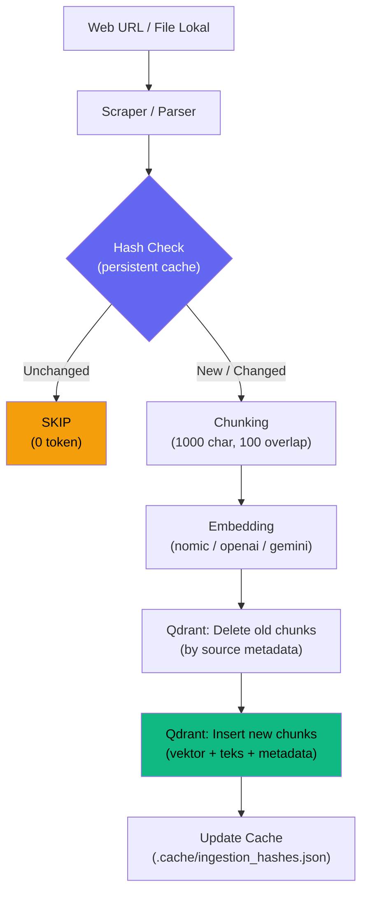
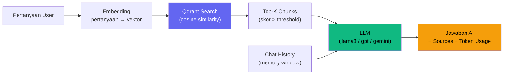

# Arsitektur RAG: Cara Kerja Ingest & Retrieval

## Apa itu RAG?

**Retrieval-Augmented Generation (RAG)** adalah teknik di mana AI **tidak mengandalkan memorinya sendiri**, melainkan **mencari konteks yang relevan** dari database sebelum menjawab. Ini membuat jawaban AI:

- **Akurat** — berdasarkan data nyata, bukan halusinasi
- **Terkini** — data bisa di-update kapan saja tanpa re-training model
- **Bisa diverifikasi** — setiap jawaban menyertakan sumber

## Alur Kerja Lengkap

### Fase Ingestion



### Fase Chat (Retrieval + Generation)




## Fase 1: Ingestion (Memasukkan Data)

### `ingest-web` — Cara Kerja Web Scraping

Ketika user menjalankan `python main.py ingest-web https://example.com`:

#### Langkah 1: Scraping

```python
# src/ingestion.py → parse_web_url()
response = requests.get(url)
soup = BeautifulSoup(response.text, "html.parser")
```

- Mengunduh halaman HTML penuh
- Menghapus elemen noise: `<script>`, `<style>`, `<nav>`, `<footer>`, `<header>`, `<aside>`
- Mencari konten utama secara cerdas:
  - `div.mw-parser-output` untuk Wikipedia
  - `<article>` atau `<main>` untuk situs HTML5
  - `div#content` sebagai fallback umum

#### Langkah 2: Chunking (Memotong Teks)

```python
# RecursiveCharacterTextSplitter
chunk_size = 1000    # Maks 1000 karakter per chunk
chunk_overlap = 100  # 100 karakter overlap untuk menjaga konteks
```

Contoh: Artikel 5000 karakter → dipotong menjadi ~5-6 chunk yang saling tumpang tindih 100 karakter.

**Mengapa di-chunk?**

- Model embedding memiliki batas input (biasanya 512 token)
- Chunk kecil menghasilkan pencarian yang lebih presisi
- Overlap menjaga konteks antar potongan tidak terputus

#### Langkah 3: Embedding (Mengubah Teks → Vektor)

```python
# src/embedding_manager.py → get_embedder()
# Setiap chunk dikonversi menjadi vektor berdimensi N
"SaaS adalah model..." → [0.023, -0.156, 0.891, ..., 0.044]  # 768 dimensi
```

- **Ollama** (`nomic-embed-text`): gratis, lokal, 768 dimensi
- **OpenAI** (`text-embedding-3-small`): berbayar, 1536 dimensi
- **Gemini** (`embedding-001`): berbayar, 768 dimensi

#### Langkah 4: Simpan ke Qdrant

```python
# vector_store.add_documents(docs)
# Setiap chunk disimpan sebagai:
{
    "vector": [0.023, -0.156, ...],      # Vektor embedding
    "payload": {
        "page_content": "SaaS adalah...", # Teks asli (untuk ditampilkan)
        "metadata": {
            "source": "https://...",
            "source_type": "web"
        }
    }
}
```

## Smart Ingestion (Deduplication & Persistent Cache)

Sistem mencegah duplikasi data dan menghemat token dengan mekanisme cerdas:

### Persistent Hash Cache

Hash setiap sumber disimpan ke `.cache/ingestion_hashes.json` — **tidak hilang saat restart**:

```json
// .cache/ingestion_hashes.json
{
  "https://id.wikipedia.org/wiki/SaaS": "a3f8c1d2e5...",
  "C:\\documents\\report.pdf": "b7e4d5f1a9..."
}
```

### Alur Smart Update

```
python main.py ingest-web https://example.com
  │
  ├── Scrape → clean text
  ├── SHA-256(clean text) → "abc123"
  ├── Cache check: cache["https://example.com"] == "abc123"?
  │     ├── YES → "Content unchanged, skipping." (0 token, 0 API call)
  │     └── NO  → Continue ↓
  ├── Qdrant: DELETE semua chunk WHERE source == "https://example.com"
  ├── Chunk → Embed → INSERT chunk baru
  └── Cache: simpan "abc123" untuk URL ini
```

### Skenario

| Aksi           | Pertama kali           | Kedua kali (tidak berubah)  | Konten berubah      |
| -------------- | ---------------------- | --------------------------- | ------------------- |
| Scrape         | ✅                     | ✅                          | ✅                  |
| Hash check     | Cache kosong → lanjut | Hash cocok →**SKIP** | Hash beda → lanjut |
| Delete old     | 0 chunk                | —                          | Hapus chunk lama    |
| Embed + Insert | ✅                     | —                          | ✅ chunk baru       |
| Token terpakai | ~1500                  | **0**                 | ~1500               |

### Berlaku untuk File & Web

- **Web URL**: hash dari konten yang di-scrape (konten berubah = re-index)
- **File lokal**: hash dari isi file (SHA-256, binary-safe)
- Kedua tipe disimpan di cache yang sama

## Fase 2: Retrieval & Generation (Chat / Q&A)

Ketika user bertanya `"apa itu SaaS?"`:

### Langkah 1: Embedding Pertanyaan

Pertanyaan user diubah menjadi vektor menggunakan **model embedding yang sama**:

```
"apa itu SaaS?" → [0.018, -0.142, 0.903, ...]  # 768 dimensi
```

### Langkah 2: Pencarian Vektor di Qdrant

Qdrant menghitung **cosine similarity** antara vektor pertanyaan vs semua vektor tersimpan:

```
Skor 0.92 → chunk: "SaaS adalah model distribusi perangkat lunak..."
Skor 0.87 → chunk: "Keuntungan SaaS meliputi skalabilitas..."
Skor 0.84 → chunk: "Contoh SaaS terkenal: Google Workspace..."
Skor 0.41 → chunk: "Kategori: Teknologi Informasi"  ← ditolak (< threshold 0.7)
```

**Parameter penting:**

- `SEARCH_SCORE_THRESHOLD=0.7` — skor minimum agar chunk dianggap relevan
- `MAX_SEARCH_RESULTS=4` — maksimal 4 chunk teratas yang diambil

### Langkah 3: Kirim ke LLM

Top-K chunk yang relevan digabung menjadi **konteks** dan dikirim ke LLM:

```
System: "Kamu adalah AI assistant. Gunakan konteks berikut untuk menjawab..."
Context: [chunk 1] [chunk 2] [chunk 3]
User: "apa itu SaaS?"
```

### Langkah 4: Jawaban + Sumber

LLM menghasilkan jawaban **berdasarkan konteks** dan menampilkan sumber.

## Strict Dimension Checking

Fitur keamanan yang mencegah kerusakan database:

```
Koleksi Qdrant ada: dimensi 768 (nomic-embed-text)
User ganti model ke: text-embedding-3-small (dimensi 1536)
→ DITOLAK! ValueError: "Strict Dimension Checking Failed"
→ User harus Re-Index dulu (menu [5]) sebelum bisa lanjut
```

Ini mencegah data vektor berukuran berbeda tercampur dalam satu koleksi.

## Conversational Memory

Sistem menyimpan riwayat chat (`MEMORY_WINDOW_SIZE=5`):

```
Turn 1: "apa itu SaaS?" → "SaaS adalah..."
Turn 2: "berikan contohnya" → AI ingat konteks sebelumnya tentang SaaS
Turn 3: "bandingkan dengan PaaS" → AI masih tahu topiknya

Setelah 5 turn, riwayat tertua dihapus untuk menghemat token.
```
