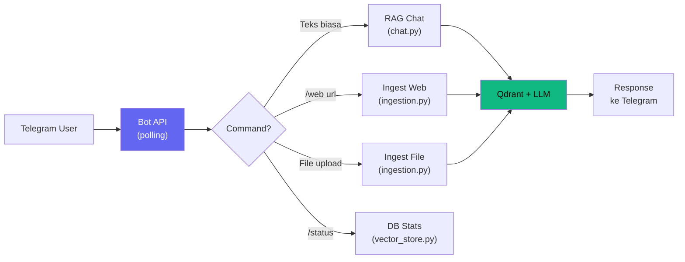

# Telegram Bot Gateway

## Pendahuluan

Telegram Bot Gateway memungkinkan semua fungsi RAG System diakses langsung dari Telegram — chat, ingest web, upload file, cek status, tanpa perlu membuka terminal.

```bash
python main.py gateway
```

## Setup

### 1. Buat Bot di Telegram

1. Buka Telegram → cari **@BotFather**
2. Kirim `/newbot`
3. Ikuti instruksi → beri nama bot
4. Copy **token** yang diberikan (format: `123456:ABC-DEF...`)

### 2. Konfigurasi `.env`

```env
# === TELEGRAM BOT ===
TELEGRAM_BOT_TOKEN="123456:ABC-DEFxxxxxxxxxxxxxxxxxxxxxxx"
TELEGRAM_ALLOWED_USERS=""   # Kosongkan = semua user bisa akses
```

#### Whitelist User (Opsional)

Jika ingin membatasi akses, isi `TELEGRAM_ALLOWED_USERS` dengan User ID (comma-separated):

```env
TELEGRAM_ALLOWED_USERS="123456789,987654321"
```

> 💡 Untuk mengetahui User ID Anda, kirim `/start` ke bot — ID akan ditampilkan.

### 3. Jalankan

```bash
python main.py gateway
```

Output:
```
🤖 Starting Telegram Bot Gateway...
   Bot: @your_bot_name
   Commands: /start, /web, /status, /clear, /history
   Press Ctrl+C to stop
```

## Commands

### 💬 Chat RAG (Teks Biasa)

Ketik pertanyaan apa saja tanpa command:

```
User: apa itu SaaS?
Bot:  SaaS adalah model distribusi perangkat lunak...

      📚 Sources:
        1. https://id.wikipedia.org/wiki/SaaS

      📊 Tokens: ~1,308 in / ~150 out / ~1,458 total
```

Bot mendukung **conversational memory** — pertanyaan lanjutan akan memahami konteks sebelumnya. Gunakan `/history` untuk reset.

### 🌐 `/web <url>` — Ingest URL

```
/web https://id.wikipedia.org/wiki/Machine_learning
```

Bot akan:
1. Scrape & hash konten
2. Hapus chunk lama (jika ada)
3. Embed & simpan chunk baru ke Qdrant

Jika konten tidak berubah (hash sama), bot akan skip dan menghemat token.

### 📄 Upload File — Auto-Ingest

Kirim file langsung ke chat (drag & drop):

| Format | Contoh |
|--------|--------|
| `.pdf` | Jurnal, laporan |
| `.txt` | Teks biasa |
| `.docx` | Dokumen Word |
| `.csv` | Data tabular |
| `.md` | Markdown |
| `.py`, `.js` | Kode (Tree-sitter semantic parsing) |

Bot otomatis memproses dan menambahkan ke Qdrant.

### 📊 `/status` — Cek Database

```
📊 Qdrant Status

Collection: universal_rag_collection
Documents: 42
Dimension: 768
Status: Online
```

### 🗑️ `/clear confirm` — Hapus Database

```
/clear          → Peringatan + instruksi konfirmasi
/clear confirm  → Hapus semua data + cache
```

### 🔄 `/history` — Reset Chat

Reset riwayat percakapan (memory window) untuk memulai topik baru.

## Arsitektur



## Fitur Teknis

| Fitur | Detail |
|-------|--------|
| **Per-user history** | Setiap user punya chat history terpisah |
| **Token usage** | Ditampilkan setiap jawaban |
| **Source dedup** | Tidak ada duplikasi sumber |
| **Smart ingestion** | Hash cache + delete-before-insert |
| **Typing indicator** | Bot menampilkan "typing..." saat processing |
| **Message splitting** | Jawaban > 4000 char otomatis dipecah |
| **User whitelist** | Opsional via `TELEGRAM_ALLOWED_USERS` |
| **Command menu** | Auto-registered di Telegram button menu |

## Log Level

Atur verbositas log di `.env`:

```env
LOG_LEVEL="INFO"      # Default
LOG_LEVEL="WARNING"   # Minimal output
LOG_LEVEL="DEBUG"     # Semua detail (debugging)
```
